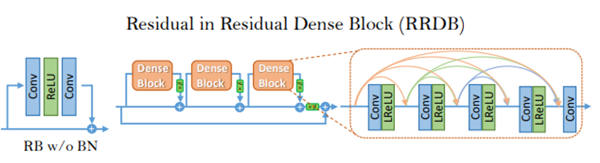
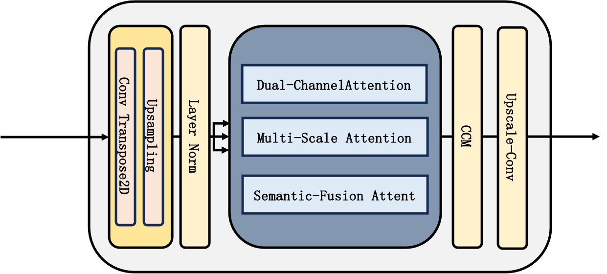
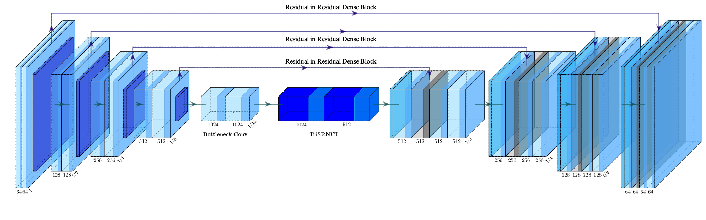

# 🌟 TreSRNet-Based Super-Resolution

## 🎯 Overview
The **TreSRNet-based Super-Resolution** project aims to build a high-performance image super-resolution model using a **Transformer-based architecture**. This model incorporates a **Triple Attention Mechanism** (Channel Attention, Spatial Attention, and Self-Attention) to boost image quality—especially when it comes to fine detail reconstruction and accurate color preservation. By tapping into the power of Transformers, it captures both **global dependencies** and **local fine-grained details**, resulting in high-quality, high-resolution images from low-resolution inputs. 📸✨

## 🏗️ Architecture

### 1. **RRDB (Residual-in-Residual Dense Block)**
The backbone of TreSRNet is the **Residual-in-Residual Dense Block (RRDB)**. This design combines **residual connections** and **dense connections** to improve the flow of information across the network and mitigate the vanishing gradient problem. These features help the model maintain rich feature information and converge faster during training. 🚀

- **Residual Connections**: Preserve previous activations for better gradient flow. 🔄
- **Dense Connections**: Pass all intermediate feature maps to later layers, enriching the feature representation. 📈



### 2. **SR Transformer**
The **SR Transformer** is designed to use advanced **attention mechanisms**, which allows the model to learn spatial and channel-wise dependencies more effectively. By using **multi-head attention**, the model captures both **local** and **global contextual information**—vital for enhancing image resolution while preserving delicate details. 🧐

- **Channel Attention**: Focuses on the importance of each feature map. 🧠
- **Spatial Attention**: Emphasizes significant regions of the image. 🗺️
- **Self-Attention**: Captures long-range dependencies across the image. 🌍



### 3. **Architecture Overview**
TreSRNet’s full architecture integrates **RRDB blocks** and **SR Transformer** to create a robust model capable of generating high-resolution images. The model also includes **upsampling layers** and **convolutional layers** to refine the final image output, ensuring both sharp details and smooth transitions. 🌈

- **Upsampling Layer**: Ensures the image is scaled to the desired resolution. 📏
- **Final Convolutional Layer**: Refines the image output with **Tanh activation** for pixel-perfect precision. ✨



## 🔥 Features
- **Triple Attention Mechanism**: Combines Channel Attention, Spatial Attention, and Self-Attention for top-notch detail reconstruction and color accuracy. 🎨
- **High Performance**: Achieves outstanding **PSNR** and **SSIM** scores, outperforming traditional super-resolution models. 📊
- **Real-Time Deployment**: Optimized for real-time image enhancement, making it ideal for photo enhancements, video upscaling, and live-streaming applications. 🎥⚡
- **State-of-the-Art Architecture**: Leverages the mighty Transformer model for contextual understanding and pixel-perfect precision. 🔥

## 🛠️ Installation

### 🖥️ Prerequisites
Before diving in, make sure you have Python 3.x installed. We recommend creating a **virtual environment** to keep dependencies clean and manageable. 🌱

1. **Clone the repository**:
   ```bash
   git clone https://github.com/anthonyhuang19/TreSRNet.git
   cd TreSRNet
